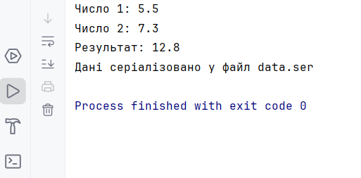
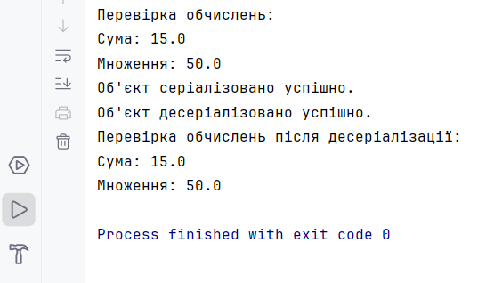
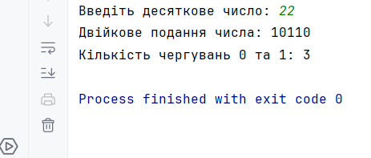

# Завдання 2: Класи та об'єкти

### Код програми 1: [main.java](main.java)

### Код програми 2: [main2.java](main2.java)

### Код програми 3: [main3.java](main3.java)

### Код програми 4: [main4.java](main4.java)